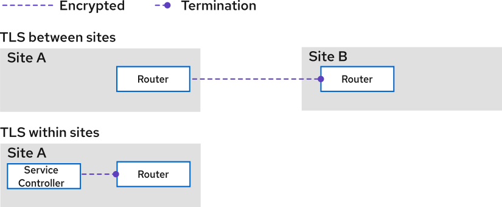

## Using custom certificates for incoming links on Kubernetes

This section describes how to replace the default certificates for Kubernetes sites.

By default, the Skupper controller creates its own Certificate Authority (CA) and self-signed server certificates. 
For example, it generates certificates to authenticate incoming links from other Skupper sites.

The default CA is named `skupper-site-ca`. 
The default server certificate is named `skupper-site-server` and is issued for the public hostname or IP address of the `skupper-router` service, based on the ingress type (for example, OpenShift Route or LoadBalancer).

You can replace these defaults with your own CA or server certificate.

## About mutual TLS between sites

When two Skupper sites are linked, the routers use mutual TLS (mTLS) for authentication. 



For information on TLS within sites, see [Encrypting service traffic](./encrypting-service-traffic.html)

The certificates and keys for traffic between sites are stored in Kubernetes Secrets:

- **`skupper-site-server`**  
  Contains the key, certificate, and CA certificate used by the `skupper-router` when accepting incoming links from other sites.
- **Client credential Secret**  
  Contains the key, certificate, and CA certificate used by the `skupper-router` when creating outgoing links to other sites. The Secret name is user-defined and referenced in the `Link` resource’s `spec.tlsCredentials` field.

Both routers must trust the peer’s CA and verify that the certificate’s hostname or IP matches the link’s address.

If `skupper-site-server` or the client credential Secret are not provided, Skupper generates them using a self-signed CA stored in the `skupper-site-ca` Secret.

> **Note:** Skupper uses the `skupper-site-ca` Secret only if a custom `skupper-site-server` or client credential Secret is not already present.

## Using a custom server certificate

To use your own server certificate, create a secret named `skupper-site-server` in the namespace of your Skupper site:

```yaml
apiVersion: v1
kind: Secret
metadata:
  name: skupper-site-server
data:
  ca.crt: <base64-ca-cert>
  tls.crt: <base64-server-cert>
  tls.key: <base64-server-key>
```

The certificate in `tls.crt` must be valid for the hostname or IP address used in your `Link` resource. To find this value for an existing site:

```bash
kubectl get site -o json | jq -r .items[].status.endpoints[0].host
```

If the site exists, Skupper detects the secret and stops managing the server certificate. Verify with:

```bash
kubectl get certificate skupper-site-server -o json | jq -r .status.conditions[].message
```

Expected output:
```
Secret exists but is not controlled by skupper
```

---

## Generating a Link

A **Link** lets a remote Skupper site connect securely to your site (incoming link). A link requires:

- A `Link` resource with your site’s connection details.
- A client certificate secret (`skupper-link`) that the remote site uses for authentication.

1. Provide `skupper-site-ca` to Skupper, it can create the client certificate secret for you. Example:

    ```bash
    kubectl create -f - <<EOF
    apiVersion: skupper.io/v2alpha1
    kind: Certificate
    metadata:
      name: skupper-link
    spec:
      ca: skupper-site-ca
      client: true
      subject: skupper.public.host
    EOF
    ```

2. Create a Link resource:
You can create a link in three ways:

    **1. Skupper CLI**
    - Auto-generate (when CA is available):
      ```bash
      skupper link generate
      ```
    - Use existing secret:
      ```bash
      skupper link generate --tls-credentials skupper-link
      ```
    - Provide your own secret:
      ```bash
      skupper link generate --generate-credential=false --tls-credentials=skupper-link
      ```
    
    **2. kubectl**
    Extract endpoints and create the `Link` YAML, then append the client secret.
    
    **3. Manual**
    Get endpoints:
    ```bash
    kubectl get site -o yaml | yq -y .items[].status.endpoints
    ```
    Write a YAML file containing both the `Link` resource and the client secret.

