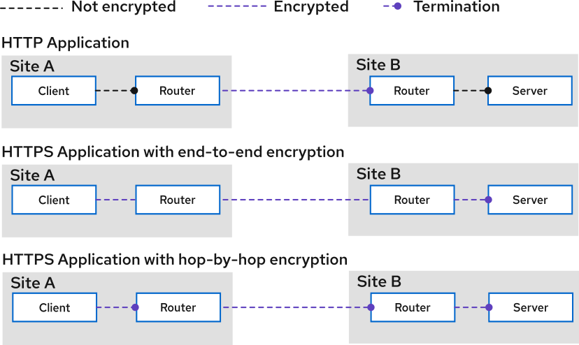

# Encrypting service traffic on Kubernetes

When the backend workload you want to expose into your Virtual Application Network (VAN) is protected with TLS, creating a simple pair of `Connector` and `Listener` (without specifying TLS credentials) will result in **TLS passthrough**.
In passthrough mode, Skupper forwards encrypted traffic from client to server without terminating or inspecting it.

However, in many cases, the TLS certificate presented by the backend server is not valid for the hostname used by the remote client.
To solve this, you can configure Skupper to **terminate TLS on the Listener** and **re-encrypt TLS on the Connector**, ensuring trusted connections on both ends using certificates that are appropriate for each hop as described in this section.

# TLS Termination and Re-encryption with Skupper

For information on TLS between sites, see [Using custom certificates for incoming links](./custom-certs.html)

* An HTTP application that receives requests from a client in a remote site. The connection between the client and the router and the connection between the remote router and the server are unencrypted. The communication between routers is always encrypted.
* An HTTPS application where the traffic is encrypted by the client and unencrypted by the remote server. This scenario might not work due to hostname mismatch or untrusted CA
* An HTTPS application where traffic is encrypted at every stage: encrypted between the client and the router, re-encrypted between the routers, and re-encrypted between the router and the server at the remote site.
This section describes that third scenario, and the Secrets required to have TLS between the application and the router.

When a TLS connection from a client of a service is terminated and re-encrypted at the router, or when the router establishes a TLS connection to a pod implementing the service, additional Secrets are required.

To set up hop-by-hop encryption requires:

- The **trusted CA certificate** for the `Connector`
- A **valid server certificate** for the `Listener`

# Configuring the Connector with a server certificate

To connect securely to a TLS-protected backend, the `Connector` must present the CA certificate trusted by the backend service.

Generate a Kubernetes `Secret` containing the following data:

- `ca.crt`: the server's trusted CA certificate

Then configure the `Connector` to use your Kubernetes `Secret` through the `spec.tlsCredentials` field.

# Configuring the Listener with a server certificate

If the traffic is not required to be decrypted at the listener, you can skip this step. 
For example if the traffic is decrypted by a device connected to the cluster.

The `Listener` can be configured to terminate TLS by specifying a Kubernetes `Secret` through the `spec.tlsCredentials` field of the Listener CR.
The server certificate must be valid for the `host` value your client applications will connect to.

For example, if your `Listener` uses `host: my-service`, then the certificate's Common Name (CN) or Subject Alternative Name (SAN) must include `my-service`.

Here are the data needed as part of your Kubernetes `Secret`:

- `tls.crt`: the server certificate (valid for the `my-service` hostname)
- `tls.key`: the corresponding private key
- `ca.crt`: the issuing CA certificate

