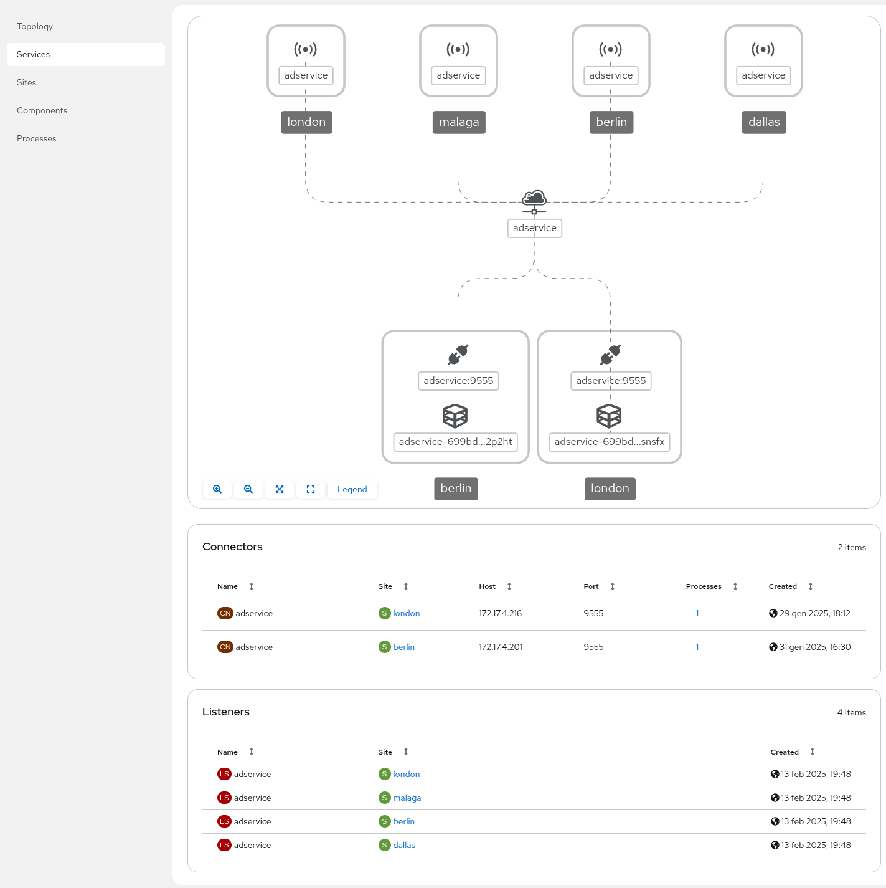

<a id="console"></a>
# Using the Network console

The Network console provides data and visualizations of the traffic flow between sites.

<a id="console-enabling"></a>
## Enabling the Network console

**Prerequisites**

* A Kubernetes site


**Procedure**

1. Determine which site in your network is best to enable the Network console using the following criteria:

   * Does the application network cross a firewall? For example, if you want the console to be available only inside the firewall, you need to locate the Network console on a site inside the firewall.
   * Is there a site that processes more traffic than other sites? For example, if you have a frontend component that calls a set of services from other sites, it might make sense to locate the Network console on that site to minimize data traffic.
   * Is there a site with more or cheaper resources that you want to use? For example, if you have two sites, A and B, and resources are more expensive on site A, you might want to locate the Network console on site B.

2. Change context to a site namespace.

3. Deploy the network observer helm chart:
   ```
   helm install skupper-network-observer oci://quay.io/skupper/helm/network-observer --version {{skupper_cli_version}}
   ```

   The output is similar to the following:
   ```
   Pulled: quay.io/skupper/helm/network-observer:2.1.1
   Digest: sha256:557c8a3f4b5d8bb6e779a81e6214fa87c2ad3ad0c957a5c08b8dd3cb20fc7cfe
   NAME: skupper-network-observer
   LAST DEPLOYED: Sun Mar  9 19:47:09 2025
   NAMESPACE: default
   STATUS: deployed
   REVISION: 1
   TEST SUITE: None
   NOTES:
   You have installed the skupper network observer!
   
   Accessing the console:
   The network-observer application is exposed as a service inside of your
   cluster. To access the application externally you must either enable an
   ingress of some sort or use port forwarding to access the service
   temporarily.
   Expose the application at https://127.0.0.1:8443 with the command:
   kubectl --namespace default port-forward service/skupper-network-observer 8443:443

   Basic Authentication is enabled.

   Users are configured in the skupper-network-observer-auth secret.
   This secret has been prepopulated with a single user "skupper" and a randomly
   generated password stored in plaintext. It is recommended that these
   credentials be rotated and replaced with a secure password hash (bcrypt.)
 
   Retrieve the password with this command:
   kubectl --namespace default \
         get secret skupper-network-observer-auth \
         -o jsonpath='{.data.htpasswd}' | base64 -d | sed 's/\(.*\):{PLAIN}\(.*\)/\1 \2\n/'
   ```
4. Expose the `skupper-network-observer` service to make the Network console available, for example on OpenShift:

   ```
   oc expose skupper-network-observer
   ```

<a id="console-exploring"></a>
## Exploring the Network console

The Network console provides an overview of the following:

* Topology
* Services
* Sites
* Components
* Processes

For example, consider the following service:


<!--

-->
