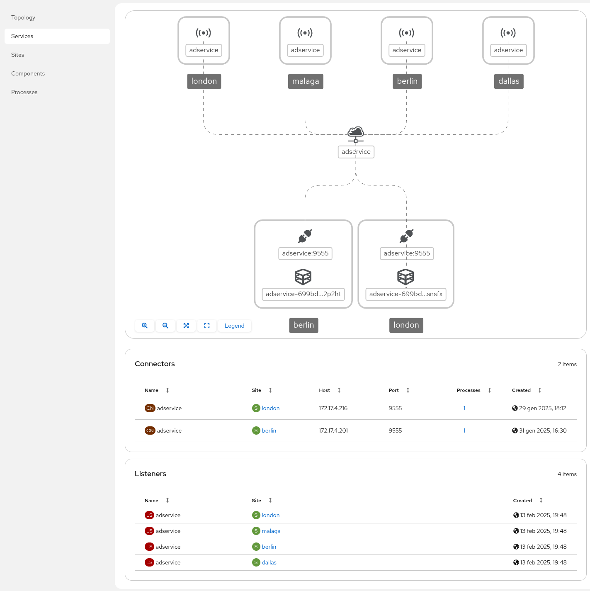

<a id="console"></a>
# Using the Skupper network console
<!--ASSEMBLY-->

The Network console provides data and visualizations of the traffic flow between sites using the Network Observer component which also deploys an API endpoint.

See [API documentation](/api/) for the OpenAPI documentation.

<a id="console-quickstart"></a>
## Getting started with Skupper network console
<!--CONCEPT-->

* Helm 3.8 or later
* kubectl access to target Kubernetes cluster
* A Skupper site 


**Site Selection Criteria**

1. Determine which site in your network is best to enable the Network console using the following criteria:
    * Does the application network cross a firewall? For example, if you want the console to be available only inside the firewall, you need to locate the Network console on a site inside the firewall.
    * Is there a site that processes more traffic than other sites? For example, if you have a frontend component that calls a set of services from other sites, it might make sense to locate the Network console on that site to minimize data traffic.
    * Is there a site with more or cheaper resources that you want to use? For example, if you have two sites, A and B, and resources are more expensive on site A, you might want to locate the Network console on site B.


2. Change context to a site namespace.

3. Install with defaults:
   ```bash
   helm install skupper-network-observer \
     oci://quay.io/skupper/helm/network-observer \
     --version {{skupper_cli_version}}
   ```

4. Access via port-forward:
   ```bash
   kubectl port-forward svc/skupper-network-observer 8443:443
   # Visit https://localhost:8443
   ```

5. Retrieve the generated password:
   ```bash
   kubectl get secret skupper-network-observer-users \
     -o jsonpath='{.data.password}' | base64 -d
   echo
   ```

**Custom Installation**

Install with custom values file:

```bash
helm install skupper-network-observer \
  oci://quay.io/skupper/helm/network-observer \
  --version {{skupper_cli_version}} \
  -f my-values.yaml
```

Example values file for external access via Ingress:

```yaml
ingress:
  enabled: true
  className: nginx
  hosts:
    - host: observer.example.com
      paths:
        - path: /
          pathType: Prefix

auth:
  strategy: basic
  basic:
    create: true
```

**OpenShift Route**

For OpenShift environments, expose using a Route:

```bash
oc create route passthrough skupper-console --service=skupper-network-observer --port=https
```

Or use Helm values:

```yaml
route:
  enabled: true
  subdomain: network-observer

auth:
  strategy: openshift
  openshift:
    createCookieSecret: true
    serviceAccount:
      create: true

tls:
  openshiftIssued: true
```

<a id="console-advanced"></a>
## Advanced Configuration
<!--CONCEPT-->

The Network Observer Helm chart includes advanced configuration options for Prometheus monitoring, data persistence, metrics collection, authentication strategies, and resource management.

**Key features:**

* **Custom Prometheus configuration** — Supply your own `prometheus.yml` and process flags
* **Persistent storage** — Store Prometheus time-series data in a PersistentVolumeClaim
* **Dedicated metrics endpoint** — Separate Service on port 9000 for cluster monitoring tools
* **External access** — Kubernetes Ingress or OpenShift Route support
* **Resource limits** — Fine-grained control over CPU and memory

For complete configuration details and examples, see [Network Observer Configuration](configuration.md).

<a id="console-config-examples"></a>
### Configuration Examples

**Persistent Storage**

```yaml
prometheus:
  persistence:
    enabled: true
    storageClass: fast-ssd
    size: 20Gi
  extraArgs:
    - --storage.tsdb.retention.time=30d
    - --storage.tsdb.retention.size=18GB
```

**Custom Prometheus Configuration**

```yaml
prometheus:
  config: |
    global:
      scrape_interval: 30s
      evaluation_interval: 30s
    scrape_configs:
      - job_name: 'network-observer'
        static_configs:
          - targets: ['localhost:8080']
      - job_name: 'my-app'
        static_configs:
          - targets: ['my-app-metrics:9090']
  extraArgs:
    - --storage.tsdb.retention.time=15d
```

**External Access via Ingress**

```yaml
ingress:
  enabled: true
  className: nginx
  annotations:
    cert-manager.io/cluster-issuer: letsencrypt-prod
    nginx.ingress.kubernetes.io/backend-protocol: "HTTPS"
  hosts:
    - host: observer.company.com
      paths:
        - path: /
          pathType: Prefix
  tls:
    - secretName: observer-tls-cert
      hosts:
        - observer.company.com

auth:
  strategy: basic
  basic:
    create: true

tls:
  skupperIssued: true
```

**Resource Limits**

```yaml
containerResources:
  networkObserver:
    requests:
      cpu: 200m
      memory: 512Mi
    limits:
      cpu: 1000m
      memory: 1Gi
  prometheus:
    requests:
      cpu: 500m
      memory: 1Gi
    limits:
      cpu: 2000m
      memory: 4Gi
  proxy:
    requests:
      cpu: 50m
      memory: 64Mi
    limits:
      cpu: 200m
      memory: 256Mi
```

**Observer Tuning**

```yaml
extraArgs:
  - -flow-record-ttl=1h
  - -vanflow-logging-profile=minimal
  - -cors-allow-all  # Development only
```

<a id="console-validation"></a>
### Validation and Troubleshooting

**Verify Installation**

```bash
# Check Helm release
helm list

# Check release status
helm status skupper-network-observer

# Get applied values
helm get values skupper-network-observer
```

**Verify Resources**

```bash
# Check Pods
kubectl get pods -l app.kubernetes.io/name=network-observer

# Check Services
kubectl get svc -l app.kubernetes.io/name=network-observer

# Check Ingress (if enabled)
kubectl get ingress skupper-network-observer

# Check PVC (if persistence enabled)
kubectl get pvc skupper-network-observer-prometheus
```

**Test Metrics Endpoint**

```bash
kubectl run -it --rm curl --image=curlimages/curl --restart=Never -- \
  curl -sS http://skupper-network-observer-metrics:9000/metrics | head -20
```

**Check Logs**

```bash
# All containers
kubectl logs deployment/skupper-network-observer --all-containers

# Network Observer container
kubectl logs deployment/skupper-network-observer -c network-observer

# Prometheus container
kubectl logs deployment/skupper-network-observer -c prometheus
```

<a id="console-upgrade"></a>
### Upgrade and Rollback

**Upgrade Release**

```bash
helm upgrade skupper-network-observer \
  oci://quay.io/skupper/helm/network-observer \
  --version {{skupper_cli_version}} \
  -f my-values.yaml
```

**Check Upgrade History**

```bash
helm history skupper-network-observer
```

**Rollback to Previous Version**

```bash
helm rollback skupper-network-observer
```

<a id="console-uninstall"></a>
### Uninstallation

**Uninstall Release**

```bash
helm uninstall skupper-network-observer
```

**Note:** PVCs are NOT deleted automatically. To remove persistent storage:

```bash
kubectl delete pvc skupper-network-observer-prometheus
```

<a id="console-exploring"></a>
## Exploring the Network console
<!--REFERENCE-->

The Network console provides an overview of the following:

* Topology
* Services
* Sites
* Components
* Processes

For example, consider the following service:


<!--

-->
