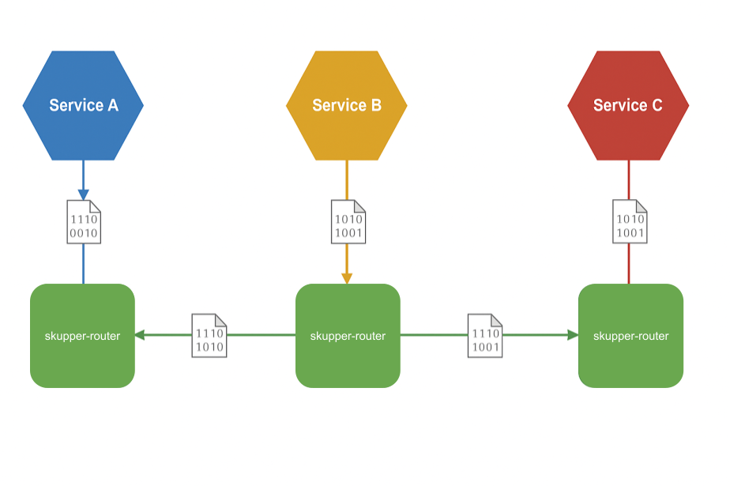

# Skupper overview

Hybrid clouds enable organizations to combine on-premises, private cloud, and public cloud resources.
While such a solution provides many benefits, it also presents a unique challenge: enabling these resources to communicate with each other.

Skupper provides a solution to this challenge with an Application Network that simply and securely connects applications running in different network locations.

## Application Networks

Skupper solves multi-cluster communication challenges through something called a Virtual Application Network or just application network.
To understand the value of Skupper, it is helpful to first understand what an application network is.

An application network connects the applications and services in your hybrid cloud into a virtual network so that they can communicate with each other as if they were all running in the same site.
In this diagram, an application network connects three services, each of which is running in a different cloud:

In essence, the application network connects the services in a distributed application with a microservice architecture.

Application networks are able to provide connectivity across the hybrid cloud because they operate at Layer 7 (the application layer).
They use **Layer 7 application routers** to route communication between **Layer 7 application services**.

## Layer 7 application routers

Layer 7 application routers form the backbone of an application network in the same way that conventional network routers form the backbone of a VPN.
However, instead of routing IP packets between network endpoints, Layer 7 application routers route messages between application endpoints (called Layer 7 application services).

**Layer 7 application services**

A Layer 7 application service represents an endpoint, or destination in the application network.
When an application sends a communication to an service, the Layer 7 application routers distribute the communication to any other application in the application network that has the same service.

For example, in this diagram, **Service B** sends a message with an application service to its local application router.
**Service A** and **Service C** are subscribed to the same service, so the application router routes copies of the message through the application network until they arrive at each destination.

In the diagram, `skupper-router` is a container or systemd process that acts as a software router for service communication.

Application networks provide multiple routing patterns, so communications can be distributed in anycast (balanced or closest) or multicast patterns.

## Skupper

Skupper is an open source tool for creating application networks in Kubernetes or Linux.
By using Skupper, you can create a distributed application consisting of microservices running in different sites.

This diagram illustrates a Skupper network that connects three services running in three different sites:

In a Skupper network, each namespace contains a Skupper instance.
When these Skupper instances connect, they continually share information about the services that each instance exposes.
This means that each Skupper instance is always aware of every service that has been exposed to the Skupper network, regardless of the namespace in which each service resides.

Once a Skupper network is formed across Kubernetes namespaces, any of the services in those namespaces can be exposed (through annotation) to the Skupper network.
When a service is exposed, Skupper creates proxy endpoints to make that service available on each namespace in the Skupper network.

