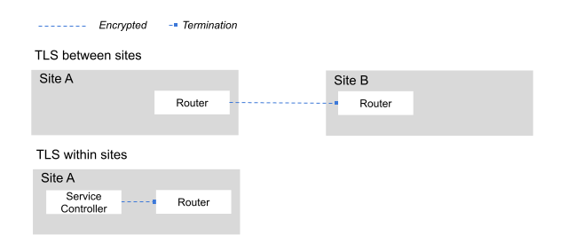

// Type: concept
[id=tls-router-app]
= Understanding TLS traffic between applications and routers

This section covers traffic between an application client and the router in a site, and then between the router and an application server in a different site.

NOTE: If you need information about TLS traffic between sites or traffic between {skupper-name} components within a site, see xref:understanding-tls[].

Consider the following scenarios:

// https://docs.google.com/drawings/d/1o5af8M4alYq206SawaFpFoLnr_8QXxbC40hSRNnBW1w/edit
.Application traffic between clients and routers, and between routers and servers

* An HTTP application that receives requests from a client in a remote site.
The connection between the client and the router and the connection between the remote router and the server are unencrypted.
The communication between routers is always encrypted.

* An HTTPS application where the traffic is encrypted by the client and unencrypted by the remote server.

* An HTTPS application where traffic is encrypted at every stage: encrypted between the client and the router, re-encrypted between the routers, and re-encrypted between the router and the server at the remote site.

This section describes that third scenario, and the Secrets required to have TLS between the application and the router.

When a TLS connection from a client of a service is terminated and re-encrypted at the router, or when the router establishes a TLS connection to a pod implementing the service, additional Secrets are required.

By default, {skupper-name} generates the following Secrets for this purpose, all sharing the prefix *skupper-service-*:

`skupper-service-client`:: Contains credentials used for the TLS connection from the router to the pod implementing the service.

`skupper-service-ca`:: Contains the trusted CA certificate used for validating client and server certificates in the TLS connection.

These Secrets can be provided by the user and specified through the `--tls-cert` and `--tls-trust` options to `skupper expose` or by using the equivalent annotations.
