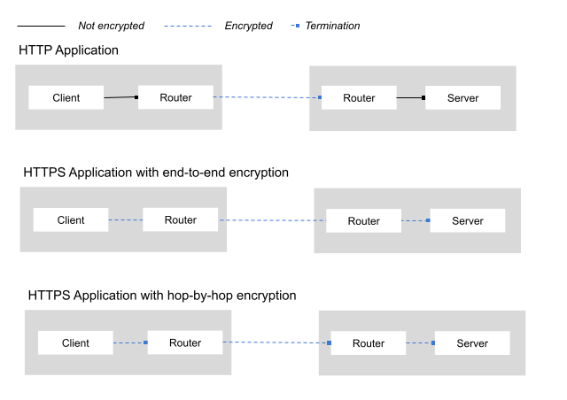

include::../partials/attributes.adoc[]
// Type: concept
[id="understanding-tls"] 
= Understanding TLS certificates for Kubernetes sites

Traffic between sites is encrypted using mutual TLS providing secure communication between Kubernetes clusters.
The traffic between {skupper-name} components within a site is also encrypted using mutual TLS.
If you do not provide certificates, certificates are generated to create the mutual TLS connection and are stored in Kubernetes Secrets.
This section describes various traffic flows and how the certificates are generated and stored, allowing you to supply certificates for various scenarios as required.

// https://docs.google.com/drawings/d/1o5af8M4alYq206SawaFpFoLnr_8QXxbC40hSRNnBW1w/edit
.Traffic between two sites and traffic within a site

NOTE: This section describes traffic between sites and traffic between {skupper-name} components within a site. In addition, the xref:tls-router-app[] section describes TLS traffic between a client and the router in a site, and then between the router and the server in a different site.

In TLS, two key checks occur during the handshake establishing the connection:

Trust of the peer’s certificate:: The certificate must be validated against a list of trusted Certificate Authorities (CAs). 
If the certificate is signed by a trusted CA and the certificate chain is valid, the peer’s certificate is trusted.

Server identity match:: The hostname or IP address used by the client to connect to the server must match the Common Name (CN) or Subject Alternative Names (SANs) in the certificate supplied by the server. 
If there is a mismatch, the connection is considered insecure.

Both conditions must be met for the connection to be established.

This section describes the Kubernetes Secrets involved for various scenarios so that you can populate those Secrets using custom certificates if required.

== Overview of TLS between sites and within a site

By default, {skupper-name} creates Secrets to support TLS for the following traffic:

xref:tls-between-sites[]:: Traffic flowing between routers, including between routers in different sites.
Communication between routers is always encrypted, including routers in different sites.

xref:tls-within-site[]:: Traffic flowing between all {skupper-name} components within a site, for example, between a router and the service controller.

When running in Kubernetes, {skupper-name} expects specific Secrets that support TLS for each of the above scenarios in each namespace where it is installed. 
These Secrets, which contain TLS keys and certificates for each of the scenarios above, are assigned predefined names.

When you create a site using the CLI or create a site declaratively using YAML, {skupper-name} creates the required Secrets if they do not already exist.

If you use your certificates to populate the Secrets before the site is created, {skupper-name} uses those certificates. 

[NOTE]
====
CA Secrets always have a name with the suffix `-ca`.
These are only used to generate certificates if the associated Secrets do not already exist.
// Possible update would be to link to article outlining 'replacing CAs'
====

TIP: See your provider documentation for generating certificates. For example, link:https://docs.openshift.com/container-platform/4.17/security/cert_manager_operator/cert-manager-creating-certificate.html#cert-manager-certificate-mgmt_cert-manager-creating-certificate[Creating certificates for user workloads] if you use `cert-manager` on OpenShift.

[id="tls-between-sites"]
== Mutual TLS between sites

When two sites are linked, the routers communicate using mutual TLS and the required keys and certificates are stored in specific Secrets:

`skupper-site-server`:: Contains the key, certificate, and the CA certificate used by the `skupper-router` when accepting links from other sites.
`<link-specific-name>`:: Contains the key, certificate, and the CA certificate used by the `skupper-router` when creating links to other sites. 
The name of the Secret is the same as the link name.

To establish a link, both routers must verify the peer's certificate was signed by a trusted CA.

The router on the linking site must verify the certificate of the peer matches the hostname or IP address used to establish the link.

If these Secrets do not exist, {skupper-name} generates and signs those certificates using a self-signed CA certificate created during site setup, which is then stored in the `skupper-site-ca` Secret.

NOTE: {skupper-name} only uses the `skupper-site-ca` Secret if `skupper-site-server` is not populated.

[id="tls-within-site"]
== Mutual TLS within a site

The {skupper-name} components within a site need to communicate. For example, the service controller needs to connect to the Skupper router. 
This connection is secured using mutual TLS, and the required keys and certificates are stored in specific Secrets, all sharing the prefix *skupper-local-*:

`skupper-local-client`:: Contains the key and certificate for the service controller, along with a list of trusted certificates used for verifying peer certificates.
`skupper-local-server`:: Contains the key and certificate for the router, along with a list of trusted certificates used for verifying peer certificates.

If these Secrets do not exist, {skupper-name} generates and signs those certificates using a self-signed CA certificate created during site setup, which is then stored in the `skupper-local-ca` Secret.

NOTE: {skupper-name} only uses the `skupper-local-ca` Secret if `skupper-local-server` and `skupper-local-client` are not populated.

include::app-tls.adoc[leveloffset=+1]

== Summary of TLS related Secrets

[cols=3s*]
|===

| Scenario | Secret Name | Notes 

| Mutual TLS between {skupper-name} sites 
| `skupper-site-ca` 
| Certificate authority for signing certificates in `skupper-site-server` and client certificates for links. 
Created by default. 
Not used if user provides other Secrets. 

|  
| `skupper-site-server` 
| The key and certificate for securing incoming links from other sites.  

|
| `<link-specific-Secret>` 
| The key and certificate for securing outgoing links to other sites.  
Named using link name and labeled with `skupper.io/type=connection-token`.

| Mutual TLS within a site 
| `skupper-local-ca` 
| Certificate authority for signing `skupper-local-client` and `skupper-local-server` Secrets. 
Created by default. 
Not used if user provides other Secrets. 

|  
| `skupper-local-client` 
| The key and certificate for the service controller. 

|  
| `skupper-local-server` 
| The key and certificate for the router.

| TLS between {skupper-name} Router and Applications 
| `skupper-service-ca` 
| Certificate authority for signing `skupper-service-client`.
Created by default. 
Not used if user provides `skupper-service-client` Secret. 

|  
| `skupper-service-client` 
| The key and certificate for securing connection between application and router. 

|===
